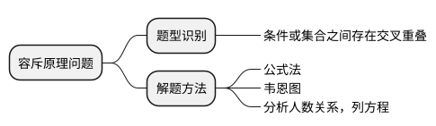

## 公式理解

1、两集合容斥

$$
A\cup B=A+B- A\cap B
$$

A+B相当于$A\cap B$加了两次，所以需要减掉一次

2、三集合容斥

$$
A\cup B\cup C=A+B+C- A\cap B - A\cap C - B\cap C + A\cap B\cap C
$$

原理和两集合类似，A+B+C里面有加了两次的，有加了三次的，那减掉$A\cap B、A\cap C、B\cap C$把加了三次的全减没了，所以得加回来

## 例题

> （2016年江苏）某班有40名学生，一次数学测验共有两道题，答对第一道的有27人，答对第二题的有23人，两题都答对的有15人，则两题都答错的人数是：

$$
\begin{align}
A\cup B&=27+23-15=35 \newline
S-A\cup B&=40-35=5
\end{align}
$$

> （2019年四川）某单位乒乓球、羽毛球、篮球三个兴趣小组共有72人参加。一直同时参加三个小组的人数为0，只参加羽毛球小组的人数是只参加乒乓球小组人数的4倍，只参加篮球小组的有11人，同时参加两个小组的人数与只参加一个小组的人数相同，参加乒乓球小组但未参加篮球小组的人中有一半参加羽毛球小组。问参加包括篮球在内的两个小组的有：

设只参加乒乓球小组人数为x，则只参加羽毛球小组的人数为4x。

只参加篮球小组的有11人，同时参加三个小组的人数为0，所以参加两个小组的人数72-x-4x-11。

同时参加两个小组的人数与只参加一个小组的人数相同，所以72-x-4x-11=x+4x+11。
所以x=5。

只参加羽毛球的人数为5人，只参加羽毛球的人数为25人。

参加乒乓球小组但未参加篮球小组的人中有一半参加羽毛球小组，所以参加乒乓球又同时参加羽毛球的人也是5。

同时参加篮球和其他运动的人数为36-5=**31**