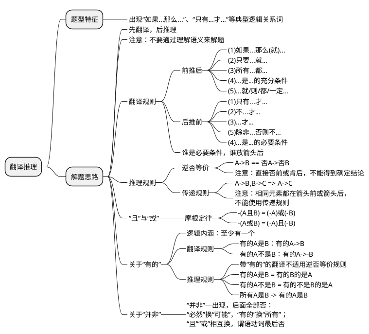
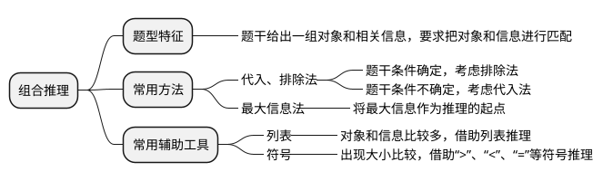
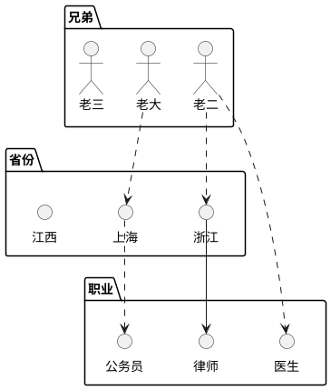
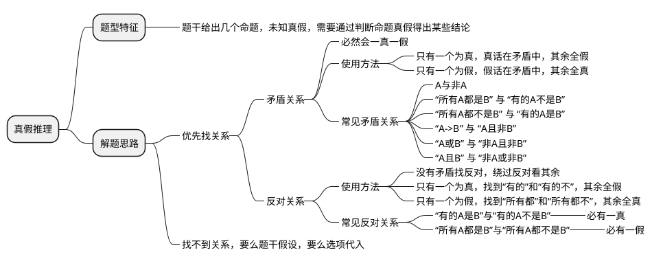

## 翻译推理/形式逻辑

注意：**不要通过理解语义来解题**，做这种题不要考虑命题本身是否正确，只要根据翻译出关系就行。理解语意反而会影响做题。

## 假言命题

### 充分条件

$$
A\rightarrow B
$$

$$
A,就/则B \Leftrightarrow A是B的充分条件 \Leftrightarrow A\rightarrow B
$$

**如果**我考上公务员，**那么**我肯定通过了笔试。 => 考上公务员 -> 通过了笔试
**如果**考到150分，**就**能上岸。 => 考到150 -> 上岸
**只要**你考上公务员，我**就**嫁给你。 => 考上公务员 -> 嫁给你
有选举权，**必须**满18岁。 => 有选举权 -> 满18岁
穷**则**独善其身。 => 穷 -> 独善其身
必须听课，**否则**考不上公务员。 => -(听课) -> -(考上公务员)
考上公务员，**离不开**刷题。 => 考上公务员 -> 刷题
**为了**考上公务员，**要**拼命刷题。 => 考上公务员 -> 拼命刷题
**凡是**我不认识的字，**都**不是字。=> 不认识的字 -> 不是字
**所有**共产党员，**都**为人民服务。 => 共产党员 -> 为人民服务
不到长城非好汉。 => -(到长城) -> -(好汉)

### 必要条件

$$
A,才B \Leftrightarrow A是B的必要条件 \Leftrightarrow B\rightarrow A \newline
$$

**只有**通过笔试，**才**能考上公务员。 => 考上公务员 -> 通过了笔试
**必要条件化为充分的逆否命题**
没有通过笔试，就考不上公务员。 => -(通过笔试) -> -(考上公务员)
A是B的前提/基础/先决条件/必然要求。 => B -> A
**没有**共产党，**就没有**新中国。 => -(共产党)->-(新中国) => 新中国 -> 共产党
**除非**好好听课，**否则**考不上。 => -(好好听课)->-(考上) => 考上 -> 好好听课
山无棱，天地合，**乃**敢与君绝。 => 与君绝->山无棱 且 天地合

### 例题

> （2018年江西）某学校有五位学生会留任委员会候选成员，分别是小张、小王、小李、小刘、小陈，其中小张、小王、小李对此次竞选的结果预测如下：
> 小张：“如果小陈没有当选，则我也不当选。”
> 小王：“我和小刘、小陈三人要么都当选，要么都不当选。”
> 小李：“如果我当选，则小王也当选。”
> 评定结果出来后，发现三人的预测都是错误的，则最终有多少人当选？
> A. 1    B. 2    C. 3    D. 4

1. 翻译成逻辑数学
   
   $$
   \begin{align}
   \neg陈 &\rightarrow \neg张 \newline
   王\land刘\land陈 &\lor \neg王\land\neg刘\land\neg陈 \newline
   李&\rightarrow王
   \end{align}
   $$
2. 三个预测都是错误的，三个命题都为假
   
   $$
   \begin{align}
   \neg(\neg陈 \rightarrow \neg张) &\Rightarrow \neg陈 \land 张 \newline
   \neg(李\rightarrow王) &\Rightarrow 李\land\neg王 \newline
   \neg(王\land刘\land陈 \lor \neg王\land\neg刘\land\neg陈) &\Rightarrow 刘
   \end{align}
   $$

小张、小李、小刘当选，小陈、小王未当选，故选C

### 量词推理

$$
\begin{align}
\exists A \rightarrow B \newline
(存在)有的A是B\newline
\newline
等价：\exists B \rightarrow A \newline
(存在)有的B是A\newline
\newline
否定：\forall A \nrightarrow B \newline
所有A不是B
\end{align}
$$

$$
\begin{align}
\forall A \rightarrow B \newline
所有A是B \newline
\newline
否定：\exists A \nrightarrow B \newline
(存在)有的A不是B
\end{align}
$$

> (2008江西)任何一本所有批评家赞许的作品都被每个文学工作者所读过，并且任何一个读过点什么的人都将谈论到它，任何一个批评家都将赞许那些推崇批评家本人的人的任一作品，张因铣推崇每位批评家，由此可见：
> * A . 张因铣写了很多作品
> * B . 所有文学工作者都读过张因铣的作品
> * C . 张因铣作品被所有批评家读过
> * D . 张因铣所有作品都被所有的文学工作者谈论

翻译：

所有批评家赞许的作品 => 该作品被每一个文学工作者所读过
所有读过作品的人=>谈论到某作品
批评家推崇

> (2008江西)来自公安机关的资料显示，娱乐圈中有人吸毒，高级知识分子中也有人吸毒，吸毒者中有些人是女性，而抢劫犯中有相当比例的人是吸毒者。由此可见（   ）
> A、高级知识分子中也有抢劫犯 B、抢劫犯中吸毒者占了大多数 C、有些抢劫犯可能是女性 D、有些抢劫犯不是女性

翻译：
$$
\begin{align}
①\exists娱乐圈\rightarrow吸毒 \newline
②\exists高级知识分子\rightarrow吸毒 \newline
③\exists吸毒者\rightarrow女性 \newline
④\exists抢劫犯\rightarrow吸毒
\end{align}
$$

* A选项：②④高级知识分子和抢劫犯是交叉关系，可能有也可能没有，A表述错误
* B选项：相当比例和占了大多数表述不一致
* C选项：③④有的抢劫犯是吸毒者，有的吸毒者是女性，所以有的抢劫犯可能是女性

## 推理规则

### 逆否等值

无风不起浪 => -风 -> -起浪 => 起浪 -> 风

### 传递规则

A->B，B->C => A->C

### 推理规则

考上公务员 -> 通过笔试

小明考上公务员 -> 小明通过笔试了 [肯前必肯后]
小明没考上公务员 -> 小明通过笔试了(不一定，可能通过了也可能没通过) [否前后不定]
小明没通过笔试 -> 小明没考上公务员 [否后必否前]
小明通过笔试了 -> 小明考上公务员(不一定，可能考上了也可能没考上) [肯后前不定]

> 如果某人是杀人犯，那么案发时他在现场。据此推出：
> A. 张三案发时在现场，所以张三是杀人犯。    肯后前不定，不定
> B. 李四不是杀人犯，所以李四案发不在现场。    否前后不定，不定
> C. 王五案发时不在现场，所以王五不是杀人犯。    否后必否前，选C
> D. 赵六不在案发现场，所以赵六是杀人犯。    否后必否前，假

> (2016江西)记者采访时的提问要具体、简洁明了。切忌空泛、笼统、不着边际。约翰·布雷迪在《采访技巧》中剖析了记者采访时向访问对象提出诸如“你感觉如何？”等问题的弊端，认为这些提问“实际上在信息获取上等于原地踏步，它使采访对象没法儿回答，除非用含糊不清或枯燥无味的话来应付”。
> 由此可以推出：
> A. 记者采访时的提问如果具体、简洁明了，就不会给采访对象带来回答的困难 否前
> B. 采访对象如果没法回答提问，说明他没有用含糊不清或枯燥无味的话来应付 否前
> C. 诸如“你感觉如何？”这样的提问，只能使采访对象抓不住问题的要点而做泛泛的或言不由衷的回答 无法关联
> D. 采访对象只有用含糊不清或枯燥无味的话来应付，才能回答那些空泛、笼统的提问

问题空泛、笼统、不着边际，采访对象就没法儿回答。=> 空泛笼统的提问->没法儿回答提问 => 回答提问->提问要具体、简洁明了
除非用含糊不清或枯燥无味的话来应付。=> 回答空泛笼统的提问->含糊不清或枯燥无味的话应付

#### 二难推理

A->B,-A->B => B
A->B,A->-B => -A

#### 矛盾命题

<header>充分条件真值表</header>

| p   | q   | p→q |
| --- | --- | --- |
| 真   | 真   | 真   |
| 真   | 假   | 假   |
| 假   | 真   | 真   |
| 假   | 假   | 真   |

A->B的矛盾 => A-/->B => A 且 -B

> 某企业家说：“初创的互联网公司只有建立用户思维，才能发展壮大为一家成功的互联网公司。”
> 如果该企业家所述为真，则以下**不可能**出现的情况是？
> A. 某家初创互联网公司有用户思维，没有成为成功的互联网公司。  否前肯后
> B. 某家初创互联网公司没有用户思维，成为了一家成功的互联网公司。  肯前否后，选B
> C. 某家初创互联网公司没有用户思维，没有成为成功的互联网公司。  否后否前
> D. 某家初创互联网公司有用户思维，成为一家成功的互联网公司。   肯后肯前

<header>p->q题型总价</header>

| 必真             | 必假        | 真假不定     |
| -------------- | --------- | -------- |
| 肯前必肯后 or 否后必否前 | 肯前 and 否后 | 否前 or 肯后 |

#### 摩根定律

$$
\begin{align}
\neg(A\land B)&\Leftrightarrow\neg A \lor \neg B \newline
\neg(A\lor B)&\Leftrightarrow\neg A \land \neg B
\end{align}
$$

如果没有阳光的照耀和雨露的滋润，那么花儿也不会开的那么鲜艳。 => -(阳光照耀)且-(雨露的滋润)=>-(花儿鲜艳)

### 例题

> （2020年山东）某城市选拔志愿者，已知情况如下：
> 
> 1) 只有小红报名，小白、小黑和小花才会都跟着报名；
> 2) 如果小白不报名，则小黑也不报名；
> 3) 如果小黑不报名，则小灰也不报名；
> 4) 小红没报名；
> 5) 小灰报名了。
> 
> 由此可推出：
> 
> - A. 小白、小黑和小花都报名了
> - B. 小白和小黑都报名了
> - C. 小黑和小白都报名了
> - D. 小白和小花都报名了

翻译成逻辑数学：

1) $白\land 黑\land 花 \rightarrow 红$
   等价于逆否命题：
   $\neg红\rightarrow\neg白\lor\neg黑\lor\neg花$
2) $\neg白\rightarrow\neg黑$ 
   等价于逆否命题：
   $黑\rightarrow白$
3) $\neg黑\rightarrow\neg灰$
   等价于逆否命题：
   $灰\rightarrow黑$
4) $\neg红$
5) $灰$

$$
\begin{align}
3\land5&\rightarrow 黑 \newline
黑\land2&\rightarrow 白 \newline
4\land1\land黑\land白&\rightarrow \neg花 \newline
\end{align}
$$

小白和小黑报名了，小花没有报名

## 组合推理

### 例题

> （2019年山东）有教师、公务员、银行职员三人，其中甲不是银行职员，乙不是教师，丙不是公务员。教师比乙年龄大，丙在三人中年龄最小。
> 根据上述条件，下列说法错误的是：
> 
> * A. 甲是教师
> * B. 乙是公务员
> * C. 甲不是公务员
> * D. 丙不是银行职员

先根据题干条件绘制一个表格

| /   | 甲   | 乙   | 丙   |
| --- | --- | --- | --- |
| 教   |     | X   |     |
| 公   |     |     | X   |
| 银   | X   |     |     |

教师比乙年龄大，丙在三人中年龄最小。可得到：

$$
年龄上：教师>乙>丙
$$

所以甲是教师，乙是公务员，丙是银行职员，答案选D。

---

> （2021年四川）档案室有五个柜子，分别放着教育学院、体育学院、人文学院、管理学院喝信息学院五个学院的资料，现在由甲、乙、丙、丁、戊五位同学来猜这五个柜子与五个学院的对应关系：
> 甲：第二个柜子是教育学院的，第三个柜子是体育学院的。
> 乙：第二个柜子是人文学院的，第四个柜子是管理学院的。
> 丙：第一个柜子是管理学院的，第五个柜子是信息学院的。
> 丁：第三个柜子是人文学院的，第四个柜子是信息学院的。
> 戊：第二个柜子是体育学院的，第五个柜子是教育学院的。
> 打开柜子后发现，每个人都只猜对了一半，而且每个柜子都有一个人猜对。由此可以推出：
> 
> * A. 第一个柜子里放着人文学院的资料
> * B. 第二个柜子里放着教育学院的资料
> * C. 第三个柜子里放着管理学院的资料
> * D. 第四个柜子里放着信息学院的资料

这种题目有两种思路：最大信息法或最小信息法

这题更适合用**最小信息法**。因为每个柜子都有人猜对，而题干信息里第一个柜子只有一个人猜，所以这个最小的信息一定的正确的，对应的另一半是错的。

* 丙：第一个柜子是管理学院的，~第五个柜子是信息学院的~；排除A、C选项
* 乙：第二个柜子是人文学院的，~第四个柜子是管理学院的~；排除A、B选项

所以答案是D选项。

---

> （2021年江苏）甲、乙、丙、丁4位中学同学毕业30年后相聚。现在，他们已成为企业家、大学教师、歌手和会计师，且每个人只有一中身份，并不重复。他们在中学时代就各人的未来职业有过如下预言：
> 甲：乙不会成为歌手
> 乙：丙会成为会计师
> 丙：丁不会成为企业家
> 丁：乙不会成为大学教师
> 现在看来，他们当中只有会计师的预言是正确的。
> 根据上述信息可以推断，甲、乙、丙、丁的职业分别为：
> 
> * A. 企业家、大学教师、歌手、会计师
> * B. 大学教师、歌手、企业家、会计师
> * C. 企业家、歌手、会计师、大学教师
> * D. 会计师、大学教师、歌手、企业家

这种题目用**最大信息法**。题干说只有会计师的预言是正确的，找到包含会计师预言的：

* 乙：丙会成为会计师；乙说丙是会计师，说明乙自己不是会计师，如果这条为真，与只有会计师的预言正确相悖。所以丙不会成为会计师，排除C选项；
* 丙：丁不会成为企业家；因为丙不是会计师，所以丁会成为企业家；答案选D

---

> （2020年四川）张先生拟购买几种鲜花，购买意向如下：
> 
> 1) 玫瑰、郁金香至多买一种
> 2) 牡丹、玫瑰和雏菊至少买一种；
> 3) 郁金香、雏菊、百合至少买两种；
> 4) 如果买郁金香，则不购买牡丹。
> 
> 根据上述一项，可以得出张先生：
> * A. 必须买百合
> * B. 郁金香、牡丹至少买了一种
> * C. 雏菊、玫瑰至少买了一种
> * D. 至少买了3种鲜花

信息不明确，仍然用**最大信息法**。题干中郁金香出现次数最多，根据郁金香进行讨论：

* 购买郁金香，根据信息1则不买玫瑰，根据信息4不买牡丹；
  不买玫瑰不买牡丹，根据信息2购买雏菊；
  购买郁金香，购买雏菊，根据信息3，百合是否购买未知；排除A、D
* 不买郁金香，根据信息3，购买雏菊，购买百合；
  其他条件无法推出玫瑰、牡丹是否购买

结合两种情况，雏菊一定会购买，答案选C

---

> （2018年江西）老大、老二、老三三兄弟分别在上海、浙江和江西工作，他们的职业分别是律师、医生和公务员。已知：老大不在上海工作，老二不在浙江工作；在上海工作的不是公务员；在浙江工作的是律师；老二不是医生。
> 那么老大、老二、老三分别在哪儿工作？
> 
> * A. 浙江、上海和江西
> * B. 浙江、江西和上海
> * C. 江西、上海和浙江
> * D. 江西、浙江和上海

## 真假推理

### 例题

> （2018年山东）甲、乙、丙、丁四人讨论本班同学完成作业的情况。
> 甲说：班里所有同学都写完作业了。
> 乙说：如果小李写完作业了，那么小赵就没写完作业。
> 丙说：小李写完作业了。
> 丁说：班里有人没写完作业。
> 已知四人中只有一人说的不对，那么可推出下列哪项？
> A. 甲说的不对，小赵没有写完作业；
> B. 乙说的不对，小李写完了作业
> C. 丙说的不对，小赵没有写完作业；
> D. 丁说的不对，小赵写完了作业；

1. 找矛盾。甲和丁的言论矛盾了，必有一真一假，四人只有一人说的不对，所以其余的人说的都是对的。

2. 看其余。小李写完了->小赵没写完 所以甲说的不对；选A

---

> （2020年山东）某慈善组织号召企业向受暴雨袭击的某地区捐赠帐篷。某地区为表谢意向该组织询问是哪些企业进行了捐赠。经调查，了解到以下情况：
> 
> 1) 四家企业都没有捐赠；
> 2) 丁企业没有捐赠；
> 3) 乙企业和丁企业至少有一家企业没有捐赠；
> 4) 四家企业中确有企业捐赠。
>    后来得知上述四种情况两种为真，两种为假。
>    由此可以推出：
>    A. 甲企业没有捐赠
>    B. 乙企业进行了捐赠
>    C. 丙企业没有进行捐赠
>    D. 丁企业进行了捐赠

1. 找矛盾。1和4有矛盾，一真一假。因为四种情况两种为真，两种为假。所以2和3也是一真一假。
2. 看其余。2和3一真一假，当2为真时，3也为真，矛盾。所以2为假，3为真；

丁企业进行了捐赠，选D

---

> （2018广西）课间休息时，一位同学帮老师擦了黑板，老师回到教室后询问是谁擦的黑板。
> 他问了四位同学，得到以下回答：
> 
> 1) 或者班长擦了，或者学习委员擦了；
> 2) 如果纪律委员没擦，那班长也没擦；
> 3) 如果卫生委员没擦，那班长擦了；
> 4) 班长和学习委员都没擦。
> 
> 实际上，四位同学的回答中只有一句是假的。具体可以推出擦黑板的是：
> 
> A. 纪律委员    B. 学习委员    C. 卫生委员    D. 班长

1. 找矛盾。看出1和4矛盾，一真一假，只有一句假的，其余为真。
2. 看其余。2逆否得到，班长擦了，纪律委员也擦了，与只有以为同学擦了黑板矛盾了，所以班长没擦。对3逆否得到，班长没擦，卫生委员擦了。所以卫生委员擦了黑板。选C。

---

> （2018年安徽）四位球迷在某球赛的晋级赛开始之前对几个队伍的赛况进行预测，他们比较关注其中的两支球队，分别做了如下预测：
> 方某说：如果甲队不能晋级，那么乙队也不能晋级；
> 白某说：不管甲队能不能晋级，乙队都不能晋级；
> 夏某说：乙队能晋级，但甲队不能晋级；
> 邓某说：我看这几支球队都不能晋级。
> 比赛结果证明，四位球迷中只有一位的预测是正确的。
> 根据上述情况，以下哪项一定为真？
> A. 白某预测是正确的
> B. 邓某预测是正确的
> C. 如果甲队能够晋级，那么方某的预测是正确的
> D. 如果甲队不能晋级，那么方某的预测是正确的

1. 找矛盾。方某和夏某的言论矛盾了，一真一假，只有一真，其余为假。
2. 看其余。
   白某和邓某都是错的，排除A、B选项。
   白某所说为假，乙队晋级
   此时得不出结论，需要代入C、D选项排除。选C

---

小丁说：“只要高局长过目， 2006年年度统计报告就不会出错。”小陈说：“如果我和小丁认真负责，高局长就不要过目。”小马说：“高局长审过了2006年统计报告，他一眼就看出其中一个统计数字有问题。”假如三人中有一人说错并且高局长确实看过 2006年统计报告，那么可以推出
A ．小马说了假话
B ．小陈说了假话
C ．小丁没有认真负责
D ．小丁或小陈没有认真负责

1. 找矛盾。小丁和小马言论矛盾了，一真一假，必有一假，其余为真。
2. 看其余。
   如果我和小丁认真负责，高局长就不要过目
   高局长确实看过报告，否后，必否前，即小陈和小丁认真负责为假
   小陈或小丁没有认真负责，选D