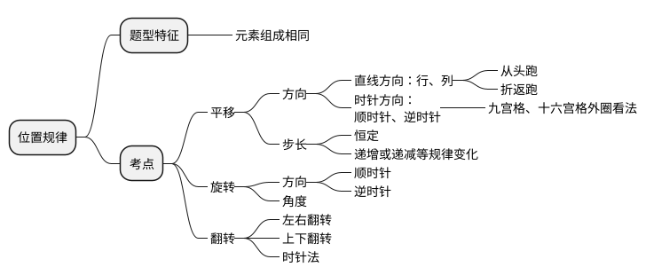
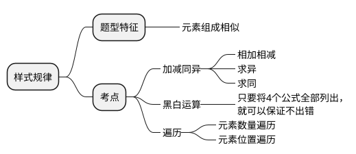
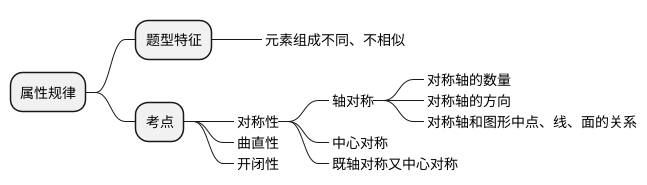
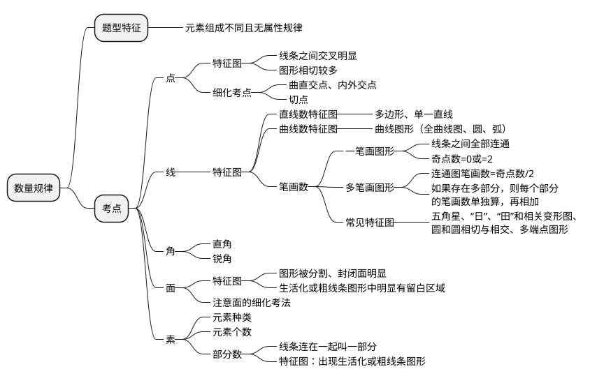
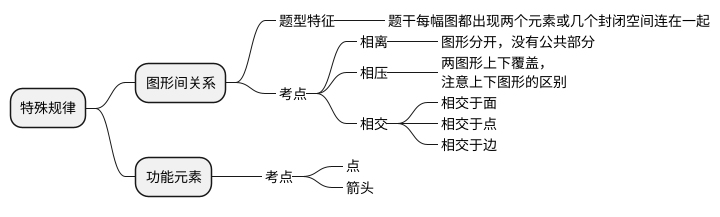
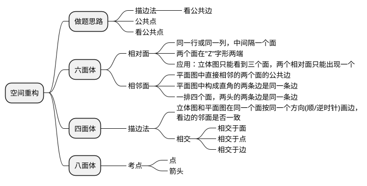
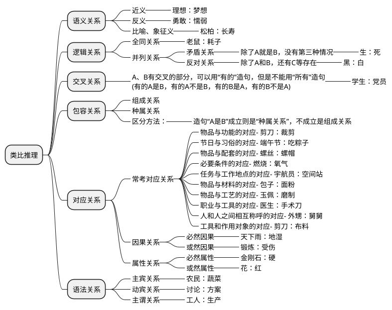

## 图形推理

<header>做题思路</header>

元素相同看位置，平移旋转和翻转

元素相似看样式，加减运算和遍历

元素不同看属性，对称开闭和曲直

属性不同看数量，面线笔画点素形

数量不同看关系，交切相离面线点

日田变形圆交切，二除奇点笔画数

<!-- more -->

### 位置规律

### 样式规律

### 属性规律

### 数量规律

### 特殊规律

### 空间重构

## 定义判断

> 定义判断题怎么做？？？ https://www.zhihu.com/question/271885649
> 定义判断 有什么学习技巧吗？ https://www.zhihu.com/question/273682592

单定义：看清题干属于/不属于，存在/不存在，找到定义的要点，选项不符合所有要点就排除

小技巧：题干属于就在题干旁边打个勾，不属于就打个叉；对选项进行判断后，是就打个勾，不是就打个叉；最后勾叉对比一下，避免忘记题干，犯不该犯的错误。

> (2016江西)择一的因果关系是指两个或者两个以上的行为人都实施了可能对他人造成损害的危险行为，并且已经造成了损害结果，但是无法确定其中谁是加害人。
> 根据上述定义，下列存在择一的因果关系的是( )
> A.甲在乙的饮水中下毒，乙喝下后在毒发前又因琐事与丙发生争吵，丙一怒之下用刀刺死了乙
> B.甲、乙共同绑架了丙，甲负责向丙的家人索要赎金，乙为避免被丙认出，将丙残忍杀害
> C.甲、乙两人在搬卸货物过程中因操作不当，造成货物损坏
> D.甲、乙、丙三人带着相同的猎枪和子弹外出狩猎，甲、乙看到一只猎物出现在丙附近，二人同时开枪，结果其中一枪打中了丙

1. 审清题干：**存在**择一因果关系
2. 定义要点：
   1) 两个或两个以上的行为人实施了危害行为
   2) 已造成损害结果
   3) 无法确定谁是加害人
3. 看选项
   * A. 不符合要点3
   * B. 不符合要点3
   * C. 不符合要点2
   * <b class="red">D.</b> 要点均符合，当选

> (2016江西)企业从银行或海外取得外汇借款后并不是直接使用外汇资金，而是将外汇结汇给银行，取得人民币资金加以使用，这种现象称之为贷款替代。
> 根据上述定义，下列哪项属于贷款替代?
> A.人民币升值后，一些企业纷纷减少人民币负债，增加外汇负债，然后再用人民币进行投资
> B.国内经济过热，商业银行对人民币贷款的发放从紧。某贸易公司出于财务考虑转向外资银行贷款，获得外币资金
> C.王明觉得人民币利率高于美元，因此他申请美元贷款，然后将外汇结汇给银行，从而获得人民币资金
> D.小宇出国旅游前去银行兑换了一些外币，到国外后他使用信用卡结算，回国后用人民币还款

1. 审清题干：**属于**贷款替代
2. 定义要点：
   1) **企业**从银行或海外取得外汇借款
   2) 不直接使用外汇资金
   3) 将外汇换成人民币资金加以使用
3. 看选项
   * <b class="red">A.</b> 要点均符合，当选
   * B. 不符合要点3
   * C. 不符合要点1,3
   * D. 不符合要点1

> (2016江西)生物学研究发现，成群的蚂蚁中，大部分蚂蚁很勤劳，寻找、搬运食物争先恐后，少数蚂蚁却东张西望不干活。当食物来源断绝或蚂蚁窝被破坏时，那些勤快的蚂蚁一筹莫展。“懒蚂蚁”则“挺身而出”，带领众伙伴向它早已侦察到的新的食物源转移。这就是所谓的懒蚂蚁效应。
> 根据上述定义，下列属于懒蚂蚁效应的是：
> A.通信工程师待遇优厚，工作时间自由，擅长攻克技术难题
> B.某汽车公司鼓励员工创新，允许员工在上班时间钻研技术
> C.某经理用人不拘一格，看重的是坚韧和正直，而非学历背景
> D.在金融危机中，某外贸公司凭借多元化经营手段渡过了难关

1. 审清题干：**属于**懒蚂蚁效应
2. 定义要点：
   1) 懒蚂蚁不正常工作
   2) 其他蚂蚁一筹莫展，懒蚂蚁可以解决
3. 看选项
   * <b class="red">A.</b> 要点均符合，当选
   * B. 不符合要点2
   * C. 不符合要点2
   * D. 不符合要点1,2

多定义：多余的定义也要看，干扰项就经常出于多余的定义。特别是多定义之间意思特别相近，更应该将多余定义看一下，注意差别。

> (2020江西)社会计算的内涵包括两个层面：一是社会的计算化，二是计算的社会化。社会的计算化是指通过人们在互联网上留下的海量而且相互关联的数据足迹，对人们的社会活动进行追踪、检索、汇编、计量和运算。计算的社会化则是指互联网创造了一种环境、一个平台，使人们能够广泛地参与计算过程，从而在数据的挖掘、分析和应用等方面获得更高效率。
> 根据上述定义，下列现象符合计算的杜会化的是：
> A.某购物平台根据用户购物经历，定期向用户推荐商品
> B.某手机导航软件能为用户自动生成一个月来的行踪图
> C.全班同学在暑假田野调查结束后合作制成精美的相册
> D.小陈在众筹平台匿名捐款后，受助者上门送来感谢信

1. 审清题干：**符合**计算的杜会化
2. 定义要点：
   * 社会的计算化
     1) 通过人们在互联网上留下数据足迹，对人的社会活动进行计算
   * 计算的社会化
     1) 互联网提供环境或平台，使人参与计算过程，从而获得更高效率
3. 看选项
   * A. 属于社会化的计算
   * B. 属于社会化的计算
   * C. 没有体现互联网
   * <b class="red">D.</b> 人们通过互联网在数据挖掘分析方面获得更高效率

> (2020江西)错觉是完全不符合刺激本身特征的失真的或扭曲事实的知觉经验，生活中，凭知觉经验所作的解释显然是失真的，甚至是错误的。幻觉是在没有相应的外界客观事物直接作用下发生的不真实感知。幻觉具有与真实知觉类似的特点，但它是虚幻的。正常人在某些特殊的状态下，如强烈的情绪体验并伴有生动的想象、回忆，或期待的心情、紧张的情绪，或处于催眠状态，都可能会出现幻觉。在入眠或醒觉状态的过程中，也会发生幻觉。
> 根据上述定义，下列属于幻觉的是：
> A. 杯弓有蛇影，草木疑皆兵
> B. 相看两不厌，唯有敬亭山
> C. 寝兴目存形，遗音犹在耳
> D. 蝉噪林逾静，鸟鸣山更幽

1. 审清题干：**属于**幻觉
2. 定义要点：
   * 错觉
     1) 完全不符合刺激本身特征的**失真的或扭曲事实**的**知觉**经验
   * 幻觉
     1) **没有相应的外界客观事物**直接作用下发生的不真实感知
3. 看选项
   * A. 由杯弓、草木客观事物产生的失真的知觉经验，属于错觉
   * B. 两看不相厌的是诗人和敬亭山，客观事物，两定义都不属于
   * <b class="red">C.</b> 睡觉起床都能看到亡妻身影，亡妻的声音也仿佛在耳畔，前面是幻觉，后面是幻听。当选
   * D. 蝉噪，林，鸟鸣，山都是客观事物，两定义都不属于

## 类比推理

> 行测类比推理怎么做？ https://www.zhihu.com/question/373977860

> (2015国考)经济赤字∶收入∶开支
> A.债务纠纷∶还钱∶借钱
> B.优胜劣汰∶适应∶淘汰
> C.销售利润∶进价∶售价
> D.背信弃义∶诺言∶谎言

题干关系：开支大于收入产生经济赤字
选项关系：
* A. 借钱没还钱产生债务纠纷
* B. 优胜略汰指适应的留下，没适应的被淘汰
* <b class="red">C.</b> 售价大雨进价产生销售利润
* D. 背离诺言是背信弃义，诺言与谎言是反对关系

