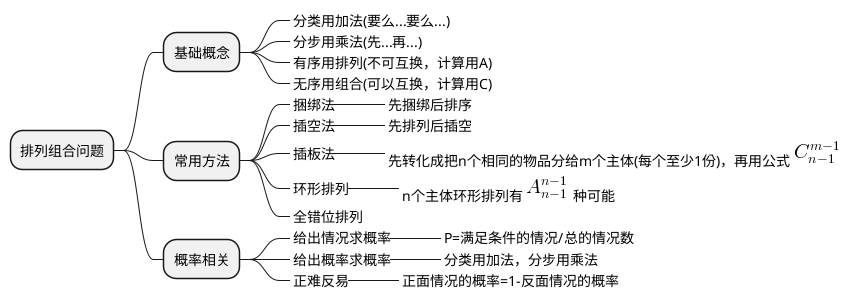

## 排列问题：关心顺序，区别对待

> 三枚奖牌，金银铜颁发给8个人中的3个人，有多少种方法？
>
> 换言之：8个人选出3个人进行排名，有多少种方法

第一步：第1名，可以在8个人中任选一个，有8种选择。A可以被替换为 B C D E F G H中的任何一个。

第二步：第2名，可以在除去已经获得金牌的人之外的7个人中任选一个，有7种选择。

第三步：第3名，在已经获得金牌、银牌的两个人之外的6个人中任选一个，有6种选择。

那么很明显，总共的颁奖方式有**8 \* 7 \* 6 种**

> 对8个人都进行排名，有多少种方法？

很明显，从第一名一直到第八名，共有**8\*7\*6\*5\*4\*3\*2\*1**种排法。

发奖牌只发三个就不发了，后面的五个人第几名都不关心了，那么排列问题可以归纳为：

$$
\frac{8!}{5!}=\frac{8\times7\times6\times5\times4\times3\times2\times1}{5\times4\times3\times2\times1}=8\times7\times6
$$

也就是

$$
\frac{8!}{5!}=\frac{8!}{(8-3)!}
$$

那么我现在有n个人，选出k个人进行排名，有多少种排列方式呢？

$$
P_n^k=\frac{n!}{(n-k)!}
$$

特别的：
$$
P_n^n=n!
$$

## 组合问题：不关心顺序，一视同仁

> 仍然是8个人，现在不发奖牌，**不排名**，只是选出三个人，有多少种组合方式呢？

因为**不关心顺序**，所以选出的三个人是"ABC"、"ACB"、BAC"、"BCA"、"CBA"还是"CAB"我都不关心，**这6种排序方式都归为同一种组合**。所以我只要排序问题后面，把三个人的排序方式除掉就行了。

$$
\frac{8!}{(8-3)!\times3!}=\frac{8!}{5!\times3!}
$$

根据排列与组合之间的关系，**组合问题就是去除掉排列问题中组合数量的排列关系**

$$
C_n^k=\frac{P_n^k}{P_k^k}=\frac{n!}{(n-k)!*k!}
$$

根据这个公式，我们也可以得到：
$$
C_n^k=C_n^{n-k}
$$

特殊的：
$$
\begin{align}
0!&=1 \\\\
C_n^n&=1 \\
\end{align}
$$

## 分组问题：多重排列组合

分组问题可以看成是多个组合问题

1. 平均分组

    > 6个人两两分组，有多少种组队方式呢？

    因为都是两人组，这里不再关心分组的排列顺序，三个分组都是等价的，所以可以除去所有队伍数量的排列数
    $$
    \begin{align}
    \frac{C_6^2 \times C_4^2 \times C_2^2}{P_3^3}&=\frac{\frac{6!}{4!\times2!}\times\frac{4!}{2!\times2!}\times\frac{2!}{0!\times2!}}{3!} \\\\
    &=\frac{6!}{2!\times2!\times2!\times3!} \\\\
    &=15
    \end{align}
    $$

2. 不平均分组

   > 6个人分3组，各组人数分别为3人、2人、1人，共有多少分法？

   因为三组数量不一样，所以选出的三组是有区别的，不能“一视同仁”。

   但是先选1人还是先选3人，这个是无所谓的，这就跟排列问题类似，先给铜牌颁奖还是先给金牌颁奖是不会影响结果的。
   $$
   \begin{align}
   C_6^3\times C_3^2\times C_1^1=\frac{6!}{3!\times3!}\times\frac{3!}{2!\times1!}&=60 \\\\
   C_6^1\times C_5^2\times C_3^3=\frac{6!}{5!\times1!}\times\frac{5!}{3!\times2!}&=60
   \end{align}
   $$
   
3. 部分平均分组

   > 6个人分成3组，各组人数分别为4人、1人、1人，共有多少种分法？

   先用上面的逻辑思考一下，按照不平均分组的逻辑，这个应该有：
   $$
   C_6^4\times C_2^1\times C_1^1
   $$
   但是当我从6个人选出4个人之后，接下来的1个人分组是等价的，其实分组方式就已经确定的，不关心后面两个人分组的顺序，所以实际的结果应该是：
   $$
   C_6^4=\frac{C_6^4\times C_2^1\times C_1^1}{P_2^2}=15
   $$

   > 延伸思考：8个人分成3组，各组人数分别为4人、2人、2人，共有多少分法？

   $$
   \frac{C_8^4\times C_4^2 \times C_2^2}{P_2^2}=\frac{8!}{4!\times4!}\times\frac{4!}{2!\times2!}\div2!=210
   $$
   
4. 不定量分组

   > 6个人分成3组，每组至少一个人，共有多少种分法？

   这个问题需要把几种分组情况列出来：4,1,1、3,2,1、2,2,2。其中等分2,2,2分组相同。这实际是前三个问题的汇总。
   $$
   \begin{align}
   \frac{C_6^4\times C_2^1\times C_1^1}{P_2^2} + C_6^3\times C_3^2\times C_1^1 + \frac{C_6^2\times C_4^2\times C_2^2}{P_3^3}&=15+15+60 \\\\ 
   &=90
   \end{align}
   $$
   
5. 分配问题

    > 6个人分成3组，每组至少一个人，然后3组分别被分配到一班、二班、三班，共有多少种分法？

    此时这个问题就有排列问题了，也就是前面的结果再乘上一个3组的全排列：
    $$
    (\frac{C_6^4\times C_2^1\times C_1^1}{P_2^2} + C_6^3\times C_3^2\times C_1^1 + \frac{C_6^2\times C_4^2\times C_2^2}{P_3^3})\times P_3^3=540
    $$

## 相同元素分组分配问题

### 分组问题

> 将6本相同的书分三组，每组至少有一本，共有多少种分法？

6本分成三组，每组至少一本，分组情况列出来：4,1,1、3,2,1、2,2,2。因为每本书相同，没有顺序关系，每种情况方式只有分法。所以总共也就**3种分法**。

### 分配问题

> 分配问题：将6本相同的书分给甲、乙、丙三个人，每个人至少一本，共有多少种分法？

这个有两种解法：

1. 常规解法：

   **第一种思路**：

   6本分成三组，每组至少一本，分组情况列出来：4,1,1、3,2,1、2,2,2。分类讨论一下：

   1) 4,1,1这种只需要看4本书被分配给谁，其余两人都是1本，即$C_3^1$

   2) 3,2,1这种，每个人分配的不一样，也就是三个人的排列，即$P_3^3$

   3) 2,2,2这种，每个人分配的都是两本一样的书，就只有1种分法。

   综合三种情况，共有$C_3^1+P_3^3+1=10$种分法。

   **第二种思路**：

   因为每个人至少一本书，而且每本书都是一样的。所以先给甲、乙、丙各分一本书，这样就满足了每个人至少一本书的条件。然后就是讨论剩下的三本书的分配问题了：

   1) 将剩余的三本书分给甲、乙、丙中的任意一个人，即$C_3^1$

   2) 将剩余的三本书分给甲、乙、丙种的两个人，其中一个人得到一本，另一个人得到两本，会产生顺序关系，因此有$C_3^2P_2^2$

   3) 将剩余的三本书分给甲、乙、丙三个人，每人一本，因为每本都一样，所以只有1种情况。

   综合三种情况，共有：$C_3^1+C_3^2P_2^2+1=10$种分法。

2. 隔板法：

   6本书都是相同的，4,1,1、3,2,1、2,2,2三种分组都只有一种情况，但是分配给甲、乙、丙三个人就不一样了，比如下面的“4,1,1”这种分法：

   

   经上图启发，6本相同的书排成一排，因为每个人至少一本，也就是从6本书形成的5个空档中插入两个隔板。

   所以根据隔板法直接得出结果：$C_5^2=10$

> 分配问题：将6本相同的书分给甲、乙、丙三个人，共有多少种分法？

这个问题和上面的`分配问题：将6本相同的书分给甲、乙、丙三个人，每个人至少一本，共有多少种分法？`区别在于，有人可能分不到书。

这个用**常规方法**解题就复杂多了，分情况讨论一下：

1) 6本书全部分给甲、乙、丙中的任意一个人，即$C_3^1=3$

2) 6本书分给甲、乙、丙中的两个人，6本书分两组又有3种情况“1-5”，“2-4”，“3-3”：

* "1-5"和"2-4"两种情况，都会产生顺序问题，$C_3^2\times P_2^2=6$

* "3-3"这种情况不会产生顺序问题，$C_3^2=3$

  综合起来就有$2\times6+3=15$种情况

3) 6本书分给甲、乙、丙中的三个人，这就是上一个问题提到的三种情况"4-1-1"、"3-2-1"、"2-2-2"，共有10种分法

综合起来共有$3+15+10=28$种情况。

如果用**隔板法**就简单多了：

结合一下上面`分配问题：将6本相同的书分给甲、乙、丙三个人，每个人至少一本，共有多少种分法？`问题的第二种常规解题思路和隔板法解题思路。

假设我有9本书分给甲、乙、丙三个人，每人至少一本，共有多少种分法？是不是就是每个人至少分一本，然后考虑6本书怎么分配给甲、乙、丙三个人。所以这个`将6本相同的书分给甲、乙、丙三个人，共有多少种分法？`和`9本书分给甲、乙、丙三个人，每人至少一本，共有多少种分法？`这两个问题结果上是一样的。那9本书用隔板法进行分配就有
$$
C_9^2=\frac{9!}{7!\times2!}=28
$$

## 捆绑法

> （2018年联考）两对夫妇各带一个孩子乘坐有6个座位的游览车，游览车每排只有一个座位。为安全起见，车的首尾两座一定要坐两位爸爸，两个小孩一定要排在一起。那么这6个人排座方法有___种。

两位爸爸排在最前，排列有$A_2^2$种方法；然后两个孩子排在一起有$A_2^2$种方法，捆绑为一个元素，最后与两位妈妈进行排列有$A_3^3$种可能。

故最后有$A_2^2\times A_2^2\times A_3^3=24$种排座方法。

## 插空法

> （2015年国考）把12棵同样的松树和6棵同样的柏树种植在道路两侧，每侧种植9棵，要求每侧的柏树数量相等不相邻，且道路起点和终点处两侧种植的都必须是松树。问有多少种不同的种植方法？

每侧的柏树数量相等，意味着两侧均有6棵松树和3棵柏树。6棵松树起点终点都是松树，柏树不相邻，也就是在6棵松树的5个间隙中插入3棵柏树，每一册有$C_5^3=10$种种植方式，两侧一起就有$10\times10$种种植方法。

